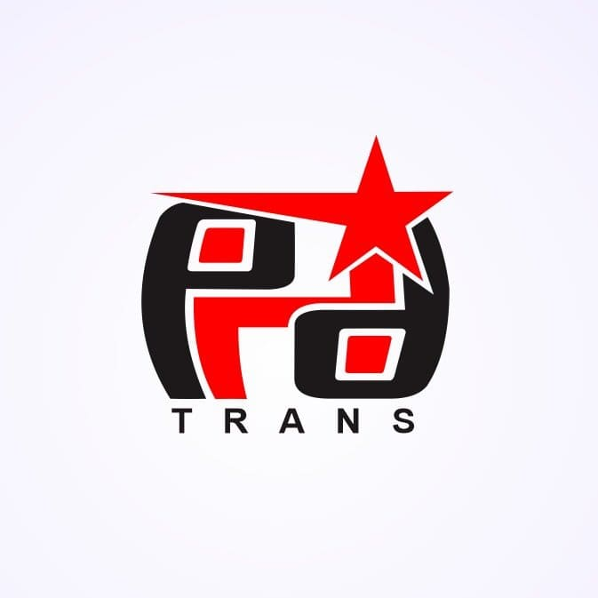

<div align="center">

  

  # PHD Trans
  ### Luxury in Motion

  <p align="center">
    <a href="#-tentang">Tentang</a> •
    <a href="#-fitur-unggulan">Fitur</a> •
    <a href="#-teknologi">Teknologi</a> •
    <a href="#-cara-memulai">Cara Memulai</a>
  </p>

  
  
  
  

</div>

<br />

## 💎 Tentang

**PHD Trans** adalah layanan sewa bus pariwisata premium yang berbasis di Nganjuk, Jawa Timur. Aplikasi web ini berfungsi sebagai etalase digital perusahaan, mencerminkan komitmen terhadap kemewahan, kenyamanan, dan keselamatan.

Website ini dirancang dengan filosofi **"Luxury in Motion"**, menampilkan antarmuka bertema gelap yang elegan, efek glassmorphism, dan animasi halus untuk memberikan pengalaman pengguna kelas atas yang setara dengan kualitas armada kami.

## ✨ Fitur Unggulan

### 🎨 UI/UX Premium
- **Hero Section Sinematik**: Kesan pertama yang memukau dengan latar belakang video dan efek teks berkilau.
- **Desain Glassmorphism**: Kartu dan kontainer transparan modern yang menyatu indah dengan estetika gelap.
- **Tata Letak Responsif**: Dioptimalkan dengan sempurna untuk semua perangkat, dari ponsel hingga layar desktop besar.

### 🚌 Showcase Armada
- **Galeri Interaktif**: Tampilan detail armada (Big Bus, Medium Bus) dengan gambar berkualitas tinggi.
- **Sorotan Fasilitas**: Ikon dan deskripsi yang jelas untuk fasilitas seperti AC, Karaoke, dan Kursi Reclining.

### 🎫 Reservasi Cerdas
- **Pratinjau Voucher Digital**: Fitur unik "Voucher Reservasi" yang menghasilkan kartu konfirmasi pemesanan yang terlihat realistis.
- **Pemesanan via WhatsApp**: Integrasi mulus dengan WhatsApp untuk pertanyaan pemesanan instan.

### 🏢 Identitas Perusahaan
- **Timeline Sejarah**: Perjalanan visual pertumbuhan dan pencapaian PHD Trans.
- **Footer Profesional**: Footer lengkap dengan tautan cepat, integrasi media sosial, dan efek cahaya dekoratif.

## 🛠 Teknologi

- **Framework**: [Next.js 14](https://nextjs.org/) (App Router)
- **Bahasa**: [TypeScript](https://www.typescriptlang.org/)
- **Styling**: [Tailwind CSS](https://tailwindcss.com/)
- **Ikon**: [Lucide React](https://lucide.dev/)
- **Animasi**: CSS Keyframes & Tailwind Utilities

## 🚀 Cara Memulai

Clone repositori dan jalankan server pengembangan:

```bash
# Clone repositori
git clone https://github.com/username-anda/phd-trans.git

# Masuk ke direktori proyek
cd phd-trans

# Install dependensi
npm install

# Jalankan server pengembangan
npm run dev
```

Buka [http://localhost:3000](http://localhost:3000) dengan browser Anda untuk melihat hasilnya.

## 📄 Lisensi

Proyek ini adalah milik **PHD Trans**. Hak cipta dilindungi undang-undang.

---

<div align="center">
  <p>Dikembangkan dengan ❤️ untuk PHD Trans</p>
  <p>
    <a href="https://www.instagram.com/phd_trans/">Instagram</a> • 
    <a href="https://wa.me/6281353343110">WhatsApp</a>
  </p>
</div>
